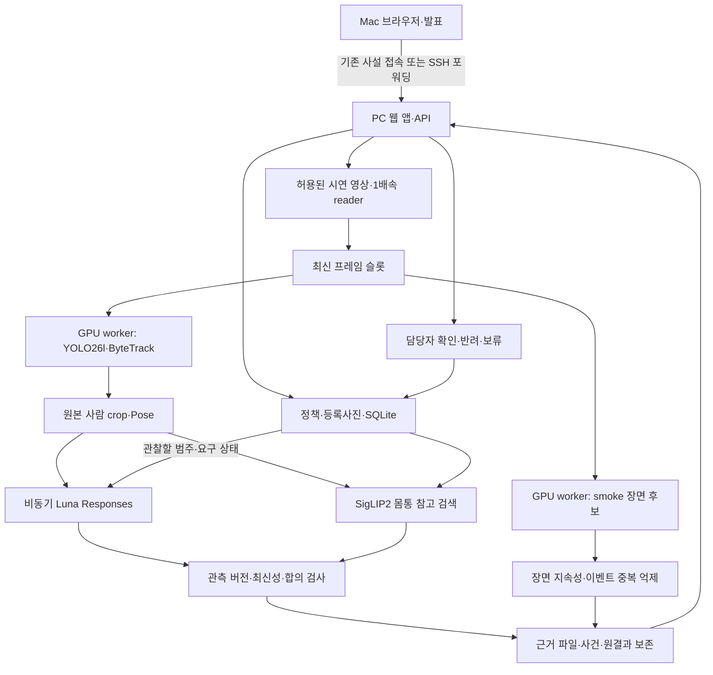

# ChemiGuard 권장 아키텍처 — 2026-10-09 신규 구현안

근거 기준: 2026-10-08까지의 사전 기록. 작성·검토: 2026-10-08~09 KST. **이 문서는 새 구현의 설계다. 아래 조합을 통합 실행·검증한 것은 아니다.**

제품 목적은 화학복 착용 관찰과 가시적 분출 의심을 담당자에게 근거와 함께 전달하는 것이다. 영상으로 제품 인증·화학적 적합성·무누출을 승인하지 않는다. 기본 환경은 Linux/RTX 3090 24GB/RAM 64GB이며 Mac M3 Pro 18GB는 원격 화면과 발표에 사용한다. 빈 저장소에서 새 코드를 작성하고 기존 앱·DB를 복사하지 않는 사용자 계획을 따른다. [PRD](PRD.md)의 요구사항과 [PREWORK](PREWORK.md)의 실제 근거를 이 문서와 함께 제공한다.

## 1. 권장안 하나

**한 PC의 작은 웹 앱 + 로컬 영상 분석 worker + 비동기 Responses 착용 관찰 + SQLite/파일 근거 저장**을 권장한다.

- 사람: **YOLO26l + ByteTrack**. CPU 개발 비교에서 어려운 CCTV를 더 잘 찾았기 때문에 품질 우선의 잠정 기본값이다. GPU 통합 비용은 미측정이며 **YOLO26s**를 부하 대안으로 준비한다.
- 부위: **YOLO26n-Pose**. 사람 검출 후 원본 crop에서 관절과 몸통·다리·필요 시 머리 영역을 구한다. 사람 주검출기는 Pose로 바꾸지 않는다.
- 착용: **gpt-6-luna / Responses / reasoning none**. 전체 사람과 같은 관측의 부위 crop으로 닫힌 질문을 한다. 기본 서비스 tier는 사전 실험의 Fast를 후보로 쓰되 실제 응답 tier와 사용 가능 여부를 확인한다.
- 제품: **SigLIP2 vision-only**로 Pose 몸통과 같은 영역의 등록 사진을 비교한다. **외형 후보를 설명하는 보조 결과**다. 보정 전 자동 제품 승인·최종 정상 판정의 근거로 쓰지 않는다.
- 장면: **FASDD smoke YOLO26s 가중치**를 가시적 흰 연무·분출 후보의 주 기술 후보로 둔다. 연기 모델을 화학 누출 모델로 재명명하지 않는다. 자산 조건은 §10의 반입 기준을 따른다.
- 결합: 제품·착용·장면 분석을 독립 상태로 표시하고, 시간 합의와 최신성 검사로 사건을 만든다. **사람 확인으로 연결**한다.
- 구현 골격: Python FastAPI, 단순 HTML/JS 화면, SQLite, 파일 저장. GPU 호출을 한 worker가 순서대로 배정하고 네트워크 API는 별도 비동기로 실행한다. 서비스 분리·Celery·Redis·벡터 DB는 P0에 필요하지 않다.

**현재 실험 코드와 달라지는 점:** YOLOE를 필수 경로에서 빼고, 미보정 제품 검색 때문에 모든 정보를 하나의 UNKNOWN으로 가리는 대신 착용·제품 후보·검토 필요를 따로 보여준다. 기존 코드의 `NORMAL_CANDIDATE`와 같은 제품 정상 승인 기능을 동등 재현했다고 주장하지 않는다. 신체 관찰과 사람 검토가 기본 제품이며, 정확 제품 승인 자동화는 후속 과제다.

## 2. 배치와 데이터 흐름



그림의 분기는 논리적 독립성이다. 3090 한 장에서 모든 신경망이 동시에 계산된다는 뜻이 아니다. **GPU는 직렬 배정, 영상 읽기·API 대기·UI는 독립**으로 시작하면 자원 경쟁과 디버깅 비용을 줄일 수 있다. 처리량이 부족한 경우에만 측정 후 배정을 바꾼다.

네트워크 경로는 현장에서 확인해야 한다. Mac의 `127.0.0.1`은 PC가 아니므로 임의의 localhost 링크를 공유하는 것만으로 원격 시연이 되지 않는다. 사용 가능한 기존 사설 접속 또는 SSH 터널을 우선한다. 새 공개 포트·인증 없는 GPU endpoint를 시연의 기본값으로 열지 않는다. 외부 API 키는 PC 환경 변수에만 보관하며 브라우저·로그·문서에 넣지 않는다.

## 3. 구성요소와 모듈 계약

다음 이름은 새 코드의 권장 모듈이다. 과거 파일 경로를 import해야 한다는 뜻이 아니다. 공통적으로 좌표는 **원본 프레임의 pixel xyxy**로 통일하고 `source_width/height`, crop offset을 기록한다.

| 모듈 | 입력 | 출력 | 실패 처리 |
|---|---|---|---|
| `policy_store` | 작업명·필수 화학복·후드/여밈·등록 제품 ID | `policy_id/revision`, reference revision | 필수 입력/출처 누락 표시, 자동 안전승인 금지 |
| `reference_registry` | 허용된 실제 사진·제품 ID·body region·bbox·view | crop 파일, 정규화 벡터, 모델/전처리 fingerprint | 사진 미확보·영역 불일치·모델 변경 시 검색 보류 |
| `video_source` | 로컬 시연 MP4 | source ID, frame seq, source time, collected monotonic time, RGB/BGR 원본 | 열기/디코드/크기/FPS 오류와 EOF 구분 |
| `person_tracker` | 원본 또는 명시된 camera ROI | 원본 좌표 bbox, session 한정 track ID | 미검출을 미착용으로 변환하지 않음 |
| `body_regions` | 원본 사람 crop | keypoints, 부위 crop, crop transform | 낮은 confidence·겹친 인물·작은 영역이면 해당 부위 UNKNOWN |
| `identity_search` | torso crop + 같은 영역 reference bank | top 후보·cosine·runner-up gap·`CANDIDATE` | reference/ROI 부족은 UNAVAILABLE, 미보정은 미확정 |
| `wearing_client` | 사람 전체+동일 관측 부위, 카테고리/요구 상태 | 5부위 가시성·명백한 위반·착용, token/tier/latency | timeout/429/잘못된 JSON → ERROR와 UNKNOWN |
| `release_detector` | 장면 원본 또는 선언한 감시 구역 | native class, bbox, score, model hash | 실패 상태 별도, 출력 0개를 안전으로 해석하지 않음 |
| `event_reducer` | 관측 envelope, 정책 버전 | wearing/identity/release 상태, 사건 | 오래된/다른 사람/구버전 관측 폐기 |
| `evidence_store` | 사건과 적용·폐기 원시 결과 | immutable observation·프레임·crop·검토 이력 | 잘못된 사건 ID 거절, 저장 실패 노출 |
| `dashboard` | 상태 API·근거 파일 | 영상·사람 카드·사건·담당자 기록 | 갱신 단절 시 STALE/연결 오류 |

### 공통 관측 envelope

아래 JSON은 **필드 설명용 예시이며 실제 측정 결과가 아니다**. null인 수치는 실제 실행 후에만 채운다.

```json
{
  "run_id": "new-run-id",
  "source_id": "source-hash-id",
  "source_mode": "live_file_processing",
  "source_frame": 120,
  "source_time_s": 4.0,
  "observation_id": "unique-observation-id",
  "observation_seq": 1,
  "track_id": 2,
  "track_generation": 1,
  "policy_revision": 1,
  "reference_revision": 1,
  "model_id": "configured-model-id",
  "model_sha256": null,
  "coordinate_system": "original_frame_pixel_xyxy",
  "source_width": 1280,
  "source_height": 720,
  "bbox_xyxy": [300, 100, 600, 650],
  "observed_monotonic_s": null,
  "completed_monotonic_s": null,
  "processing_state": "WAITING",
  "raw_result": null,
  "applied": false,
  "discard_reason": null
}
```

입력 관측 시각·API 응답 시각·영상 안의 시각을 별도로 저장한다. `source_time_s`는 영상 안의 위치이며 wall time과 섞어 TTL을 계산하지 않는다. PC의 단조 시계를 TTL·지연 측정 기준으로 사용하고 UTC는 검토 기록 시각에 사용한다.

### 최소 저장 구조

SQLite의 `policies`, `products`, `references`, `runs`, `observations`, `events`, `reviews`면 충분하다. reference 벡터는 모델 식별자·region·전처리와 함께 float32 blob 또는 작은 배열 파일로 저장한다. 제품 수가 작으므로 NumPy cosine 전체 검색을 사용한다. 벡터 DB를 도입할 이유는 아직 없다.

제품별 점수는 같은 region의 reference 중 상위 `min(2, 등록 장수)`개 cosine 평균으로 시작한다. 기존 검색에서 사용한 집계 규칙을 재사용하는 것이며, 등록 장수가 다른 제품 간 보정이나 제품 일치 임계값을 검증한 것은 아니다. 제품별 reference 수, 개별 점수, 1·2위 차이를 함께 기록한다. 후보가 있다는 사실과 승인 여부를 분리한다.

파일 구조 제안:

```text
models/                         # 반입 가중치와 로딩 설정
data/references/                 # 당일 새로 등록한 허용 사진
data/chemiguard.sqlite3          # 당일 생성
runs/<run_id>/run.json           # 입력·모델·정책·설정·코드 SHA
runs/<run_id>/observations.jsonl # 원시 결과 + 적용/폐기 사유
runs/<run_id>/evidence/          # 관측 당시 프레임과 실제 전송 crop
runs/<run_id>/metrics.json       # 실제 측정 후 생성
```

검토는 `event_id`, 담당자, action, timestamp, note를 새 행으로 추가한다. 기존 모델 결과의 label을 덮어쓰지 않는다. raw response 전체에 비밀 키나 base64 이미지를 중복 저장할 필요는 없다. 실제 입력 crop과 hash, 응답·요청 식별자를 연결한다.

### 최소 API

`POST /references`, `POST /policies`, `POST /runs`, `POST /runs/{id}/stop`, `GET /runs/{id}/status`, `GET /events`, `GET /events/{id}`, `POST /events/{id}/reviews`를 권장한다. P0 화면은 0.5~1초 polling으로 충분하며 아직 네트워크 처리율은 측정하지 않았다. 전체 CCTV 원본을 계속 API에 업로드하지 않는다. PC에 준비된 허용 영상 ID만 실행하고, 임의 서버 파일 경로를 브라우저 입력으로 열지 않는다.

### 최소 요청·응답 계약

아래는 **새 구현용 예시**이며 기존 실행 API나 실제 입력값이 아니다. 필드와 유효성 검사를 먼저 구현하고, 사용하지 않는 선택 기능은 추가하지 않는다.

`POST /references`는 `image` 파일과 다음 `metadata` JSON을 multipart로 받는다. bbox는 업로드 원본 사진의 pixel xyxy다. 제품 ID·제품명·출처·사용 범위·view·region·bbox가 필수이며 파일 저장과 임베딩 성공 뒤에만 등록 완료로 답한다. 링크만 있으면 `pending_media` 상태다.

```json
{
  "product_id": "demo-suit-a",
  "product_name": "담당자가 입력한 제품명",
  "view": "front",
  "region": "torso",
  "bbox_xyxy": [100, 150, 500, 650],
  "source": "촬영자 또는 원출처 URL",
  "usage_scope": "사용자가 확인한 시연 허용 범위"
}
```

`view`는 `front/back/side/other`다. 새 reference에는 ID·이미지 hash·모델 fingerprint·reference revision을 서버가 부여한다. revision이 바뀌면 진행 중 실행을 중지하고 새 정책 revision/실행으로 시작한다.

`POST /policies`의 최소 본문:

```json
{
  "name": "시연 작업 기준",
  "zone_id": "demo-zone",
  "coverall_required": true,
  "hood_required": false,
  "closure_required": false,
  "identity_required": true,
  "required_product_id": "demo-suit-a",
  "reference_revision": 1,
  "release_monitoring": true
}
```

정책 ID와 revision은 서버가 생성한다. `identity_required=false`이면 `required_product_id`는 null일 수 있다. true이면 등록된 제품 ID와 reference revision이 필수다. **제품 확인 필수 정책은 SigLIP 후보만으로 통과시킬 수 없으므로 자동 상태는 REVIEW_REQUIRED**다. 담당자의 확인 기록은 관측의 제품 판정을 덮어쓰지 않는다. `coverall_required=false`인 실행은 착용 분기를 비활성화한다. 후드·여밈 요구는 coverall이 필수인 경우에만 허용한다.

`POST /runs`는 `source_id`, `policy_id`, `policy_revision`, `model_manifest_id`를 필수로 받는다. 시작할 때 입력·정책·reference revision·모델 설정을 snapshot으로 고정한다. 원격 클라이언트가 모델 경로나 API 키를 지정하지 않는다.

API에 요구할 착용 **성공 응답**의 예시:

```json
{
  "visible": {
    "torso": "YES",
    "left_arm": "YES",
    "right_arm": "NO",
    "left_leg": "YES",
    "right_leg": "YES"
  },
  "visible_violation": "NO",
  "wearing": "YES",
  "hood": "not_required",
  "closure": "not_required"
}
```

위 예시는 오른팔이 보이지 않으므로 앱에서 **UNKNOWN**으로 변환한다. `visible` 5항목·`visible_violation`·`wearing`은 YES/NO enum이며 모델이 최종 앱 상태를 직접 지정하지 않는다. `hood`는 `covered/uncovered/invisible/not_required`, `closure`는 `closed/open/invisible/not_required`다. 비필수 항목은 not_required만 허용한다. 모든 key를 필수로, `additionalProperties=false`로 지정한다. 전송 실패·거절·불완전 JSON은 정상 schema 값으로 꾸미지 않고 `raw_result=null`, 오류 코드와 ERROR/UNKNOWN으로 저장한다. 성공 응답에도 논리 모순 검사를 적용한다.

`POST /events/{id}/reviews`의 필수값은 `reviewer`, `action`, `note`다. action은 `ACKNOWLEDGED/DISMISSED/DEFERRED`이며 서버 시각·review ID를 추가한다. 사건은 PPE와 장면별로 각각 저장할 수 있어 같은 시각의 위반 의심과 분출 의심이 서로 덮어쓰지 않는다.

## 4. 관측·시간 합의·오류 처리

### 4.1 작은 스케줄러

시작 설정은 **새 설계의 잠정값**이다. 사전 전체 서비스 결과로 검증된 설정 묶음이 아니다.

| 설정 | 시작값 | 의미 |
|---|---:|---|
| 사람 검출 | 최대 10Hz, imgsz640, conf0.1, person class0 | 검출 설정은 개발 비교의 출발값. 10Hz는 제안값. ByteTrack 상태는 영상 세션 단위 |
| Pose·참고 검색 | 사람별 최소 0.5초 간격 | 한 번의 배치 최대 2명으로 시작 |
| smoke 장면 분석 | 최대 5Hz, imgsz960, conf0.25 | 저장 smoke 시험의 해상도/conf를 출발점으로 하되 batch1. 5Hz는 제안값 |
| GPU 실행 | worker1, 대기열 최신 작업만 유지 | 원본 영상프레임 무한 누적 금지. 사람·장면 작업을 번갈아 처리 |
| API 동시 요청 | 1개 | 처음부터 부위별/사람별 fan-out을 만들지 않음 |
| 같은 사람 API 재요청 | 최소 2초, 새로운 관측만 | 이전 요청/응답을 반복 표로 세지 않음 |
| 착용 관측 TTL | 수집 시각부터 5초 | 완료 시각부터 5초 연장하지 않음 |
| API deadline | 5초 | 도착이 늦으면 결과 보존하되 현재 상태에 미적용 |
| 착용 합의 | 최신 연속 2관측, 최대 10초 창 | 서로 다른 관측이며 사람·세대·정책·wearing/요구 상태가 일치. 현재 표시는 최신 관측 TTL도 충족 |
| 장면 의심 지속성 | 같은 구역·공간상 연속 후보가 1초 이상, 관측 3회 이상 | **미검증 휴리스틱**. 생략 구간/TTL 경계는 아래 조건을 적용 |
| 장면 관측 TTL | 2초 | 갱신 실패면 STALE. 미검출과 오류를 구분 |

장면 지속성은 인접 후보 IoU≥0.3을 잠정 연결 조건으로 두고 마지막 양성 사이가 0.6초를 넘거나 처리 장애가 생기면 연속성을 끊는다. 값은 교란과 순간 분출을 포함한 개발 사례에서 한 번 확인하고 동결한다. 빠른 분출을 놓치면 지속시간을 줄이는 대신 오경보 변화도 함께 기록한다. 흰 작업복 오탐은 오래 지속될 수 있으므로 **시간 조건만으로 해결됐다고 주장하지 않는다**. 위치만 보고 사람과 겹친 연무를 모두 제거하면 실제 분출도 지울 수 있어 자동 사람 마스크 억제는 P0에서 제안하지 않는다.

시연 전에 담당자가 카메라 전체에 적용할 감시 구역을 선택할 수 있다. 선택 구역과 원본을 화면에 표시하고 해당 카메라의 모든 영상에 동일 적용한다. 영상 정답을 본 뒤 양성만 남기는 프레임별 ROI는 금지한다. 별도 평가셋에는 사전에 고정한 구역만 사용한다.

### 4.2 착용 관찰 규칙

Luna 입력은 사람 전체가 1차 근거이며 같은 시각 몸통·다리를 상세 정보로 추가한다. 후드가 필수일 때만 머리를 추가한다. 제품명·등록 reference·SigLIP 점수는 전달하지 않는다. 모델의 화학적 적합성/정확 SKU 추정을 질문하지 않는다.

시작 요청 설정은 `model="gpt-6-luna"`, `reasoning.effort="none"`, `service_tier="fast"`, 이미지 JPEG quality85·`detail="high"`다. 사람·몸통·다리 3장을 한 요청에 보내고 후드가 필수이면 머리 1장을 더한다. Fast 응답을 실제로 받은 과거 기록이 있지만 당일 계정 동작을 보장하지 않으므로 요청 tier와 실제 응답 tier를 각각 기록한다. `high`는 이미지 입력의 시각 처리 옵션이며 JPEG 압축 품질85와 다른 값이다. 같은 관측을 부위별 API 여러 개로 나누지 않는다.

가시성 5개(몸통·왼팔·오른팔·왼다리·오른다리), `visible_violation`, `wearing`을 닫힌 YES/NO로 받고, 후드/여밈은 필요한 경우 `covered/uncovered/invisible`, `closed/open/invisible`로 받는다. Structured Outputs 후에도 파싱·불완전 응답·거절·논리 모순을 검사한다.

- 명백히 보이는 부분에서 위반이 있고 wearing=NO → 내부 NOT_WORN.
- 위반 없음, wearing=YES, 필요한 5부위 모두 충분히 보임 → 내부 WORN.
- 가림·작음·부위 누락·모순·오류 → UNKNOWN.
- 관절 confidence 또는 몸통 crop 존재만으로 신체가 실제로 보였다고 처리하지 않는다. 유효 Pose 몸통이 없으면 이 버전에서는 사람을 유지하되 착용 요청을 보류하고 `insufficient_body_evidence`를 표시한다. 이 선택은 호출 억제와 검증 범위 제한이지 미검출 해결이 아니다.

착용 관찰과 요구 상태는 별도로 적용한다. 몸에 입은 상태가 WORN이어도 **필수 후드가 uncovered이거나 필수 여밈이 open이면 위반 의심**이다. 같은 요구 위반이 최신 연속 2관측에서 확인되면 `VIOLATION_SUSPECTED` 사건을 만든다. 필수 후드·여밈이 invisible이면 `REVIEW_REQUIRED`이며 규칙을 통과시킬 수 없다. 요구하지 않은 후드 상태를 임의로 위반으로 추가하지 않는다.

여밈 위치를 모든 제품의 앞 지퍼로 가정하지 않는다. 담당자가 제조사 자료로 확인한 제품 구조를 정책에 메모하고 해당 위치가 보일 때만 관찰한다. 위치를 모르거나 가려졌으면 invisible이다. 등 여밈 제품에서 앞쪽에 지퍼가 없다는 이유로 위반을 만들지 않는다.

합의는 과거에서 일치하는 두 표를 골라 만들지 않는다. 최신 결과가 UNKNOWN이면 현재 착용도 UNKNOWN으로 표시하고 `REVIEW_REQUIRED`로 보낸다. ERROR는 처리 장애를 함께 표시한다. 중간 UNKNOWN·ERROR·반대 결과 또는 TTL을 넘는 관측 단절이 나오면 연속 합의를 끊으며, 다시 같은 유효 결과 2개를 받아야 한다. 합의 전 단일 결과는 근거에 보존하되 현재 착용은 UNKNOWN/확인 중으로 표시한다. 이미 생성한 사건은 기록으로 남기고 최신 상태와 구분한다.

새 구조는 YOLOE placement 통과를 WORN의 필수 조건으로 요구하지 않는다. 따라서 WORN은 **착용 관찰만**이고 정확 제품 및 규칙 전체 충족을 뜻하지 않는다. 이 의미 변경과 오탐 가능성을 검수 A01~A04에서 확인한다.

### 4.3 비동기 결과와 회복

- 요청에 run/source/track generation/observation/policy revision을 묶는다. 트랙 소실·ID 재사용·영상 탐색·재시작·정책 변경 시 generation을 바꾸고 합의 기록을 지운다.
- 같은 세대 안에서도 `observation_seq`가 `last_applied_observation_seq` 이하인 응답은 중복 또는 역순 결과로 폐기한다. deadline을 넘긴 요청이 뒤늦게 완료되어도 더 최신 상태를 덮어쓰지 않는다.
- 만료·다른 세대·다른 정책 응답은 로그에 남기되 적용하지 않는다. UI 재표시는 표를 늘리지 않는다.
- 동일 PPE 의심 사건은 같은 run/track generation/정책에서 한 건으로 유지하고 최신 유효 근거를 추가한다. 장면 사건은 구역과 시간 범위를 연결하며 자동 종료를 안전 회복으로 표시하지 않는다.
- API 장애는 즉시 UNKNOWN/ERROR. 실패 요청을 자동 반복해 큐를 늘리지 않는다. 429의 Retry-After 또는 짧은 재시도 대기 뒤 **새 관측**을 다음 정상 주기에 1회 시도한다. auth/model 오류는 수동 설정 수정 전 재호출을 멈춘다.
- API가 실패해도 로컬 사람·smoke 분석은 계속한다. GPU OOM은 로컬 분기 ERROR로 노출한다. 다른 모델을 몰래 로딩해 결과를 혼합하지 않는다.
- API 부위 결과를 Decisions로 보내거나 Decisions를 Responses로 재확인하는 자동 cascade는 사용하지 않는다. Qwen 자동 fallback도 없다.

## 5. 선택 근거와 대안 비교

아래 평가는 사전 기록을 근거로 한 설계 판단이다. 동일 조건으로 시험하지 않은 대안 사이의 숫자 우열을 만들지 않는다.

| 후보 | 판정 품질 근거 | 시간 근거 | 구현·API 의존·실패 처리 | 선택 |
|---|---|---|---|---|
| YOLO26l + ByteTrack | E03 27/27, S36 6/6; 중복1, ENEX는 s와 같은5/6 | CPU 평균111.36ms/90프레임. 3090 통합 미측정 | 기존 패키지, 외부 API 없음 | **잠정 기본** |
| YOLO26s + ByteTrack | E03 24/27; ENEX5/6·호스1 | CPU37.65ms. l보다 적은 관측 비용 | 동일 입출력, 교체 쉬움 | 부하 대안 |
| YOLO26n-Pose 주검출 | E01 3/6, detect는5/6 | CPU24.21ms | 모델 하나로 줄지만 사람 누락 근거 있음 | 부위 보조로만 |
| YOLOE → SigLIP 의무 경로 | E05 후보 없는 장면, prompt 변경으로 후보 소실; 제품 오검색 | 기존 전체 영상 실행은 있으나 YOLOE 제거 효과 미측정 | 후보 귀속·placement·prompt 관리 필요 | P0에서 제외, 후속 비교용 |
| Pose torso → SigLIP 참고 검색 | E06 제조사3/4, 높은 오검색 유지 | CPU 유효5건 중앙 약233ms, GPU 새 조합 미측정 | 후보 단계 감소, 제품 확인은 미확정 | **보조 검색 채택** |
| PE-Core 또는 다중 encoder | E05 top1 7/8로 SigLIP과 동률 | 각 단독 GPU 인코딩 시간만 존재 | 새 벡터 은행·설정·판정 조건 필요 | 제외 |
| Luna Responses none/Fast | E09 7개 개발관찰 일치, 영상 가림 UNKNOWN 다수·부분착용 사건 관측 | 사진 p50 1.419s; 이전 Fast축약1.128s는 다른 질문 | 인터넷 의존, 명시적 오류/TTL/사람 확인 | **착용 기본** |
| Decisions API | E11 두 조건5/7, 가린팔 개선과 탈의 퇴행 | 같은7장 paired p50 .442/.541s | 빠르지만 새 통합·시각 오류 검증 필요 | 실험 대안, 기본 제외 |
| Qwen3-VL-4B | 과거 영상 API대비 별도 기록, 가림/프롬프트가 현재와 다름 | 과거 두사람6회 평균3.033s | GPU 공유·모델 복구 필요. 현재 설정 경로 없음 | 준비된 fallback으로 취급하지 않음 |
| smoke YOLO26s | E14 heldout 사진·외부영상 있음, 흰 작업복 오탐 | 오프라인 batch 영상, 전체 경보 지연 없음 | 외부 API 없음, 오경보→사람 검토 | **가시적 징후 잠정 기본** |
| full-gas / liquid / pipe | E14 양성 반응 감소, ENEX 분출 누락·반사 오인 | 동일 서비스 지연 비교 없음 | 여러 모델·규칙 추가 대비 이득 불명확 | 기본 제외 |
| 전체 영상 VLM·다중 모델 합의·클라우드 GPU | 이 조합의 품질 근거 없음 | 미측정 | 전송·비용·배포·장애 조합 증가 | P0 제외 |

### 결정을 바꿀 조건

| 결정 | 추가 시험 한 가지 | 변경 조건 |
|---|---|---|
| person l | 같은 1~2명 영상에 새 PPE+smoke 구성 2분 1회 | 3090 local 5Hz 목표 미달/OOM이면 같은 자료로 s 한 번 비교. 놓침 증가를 함께 공개 |
| YOLOE 생략 | 정상·부분착용·가림·타제품 고정 세트 | 착용 관찰 품질이 회귀하거나 몸통 ROI를 못 얻는 비중이 커서 제품 참고 검색이 무의미하면 YOLOE 대안 시험을 별도로 설계. 무조건 복구 아님 |
| Responses | 동결한 별도 촬영 사례 + API 지연/장애 1회 | 의미 있는 품질 저하/계정 사용 불가면 해당 기능 미완료·사람 확인. Decisions 변경은 별도 paired 검증 후만 |
| SigLIP 참고 순위 | 등록 1/3장, 같은 query·타제품·일반옷 | 후보 표시도 오해를 낳으면 검색을 숨기고 “미확정”과 원본 reference만 제공. 임계값을 낮춰 통과시키지 않음 |
| smoke 의심 | 분출·흰 작업복·증기/먼지·빈 현장 | 허용 범위에서조차 오경보가 심하면 ‘검토용 후보 실험’으로 시연 범위를 낮춤. 파일/시간 hardcode 금지 |
| PC 원격 | Mac에서 시작/중지·증거 확인·연결 중단 | 안정적 접속 실패면 녹화 재생을 표시하거나 PC 현장 시연. 새 클라우드는 검증 여유 있을 때 별도 결정 |

## 6. 재사용 방식과 새 구현의 비용·위험

다음 비용은 시간 실측 견적이 아니라 상대적 구현 부담이다.

| 방식 | 부담 | 이점 | 위험 | 이번 선택 |
|---|---|---|---|---|
| 기존 실험 코드 전체 복사 | 초기 낮음, 정리 중간 이상 | 이미 작동한 경로 보유 | 역사적 옵션·경로·YOLOE 의존·기존 결과 재생을 새 구현으로 오해 | 사용자 계획과 달라 선택하지 않음 |
| 검증된 계약·규칙을 새 작은 모듈로 작성 | 중간 | 관측 분리·오류 처리·근거 구조 명확, P0 범위 축소 | 기존 guard 누락 가능 | **권장: 가중치·설계 지식만 재사용** |
| GPU cloud·벡터 DB·다중 서비스·새 모델 도입 | 높음 | 향후 확장 가능 | 연결·배포·원인 추적·검증 범위 증가 | 당일 제외 |

재사용할 지식은 원본 좌표 복원, 동일 관측 crop 연결, closed schema, TTL·generation·서로 다른 2관측 합의, API 오류와 관찰 UNKNOWN 분리, SigLIP vision-only 로딩, append-only 사람 검토다. 사전 소스/결과는 **참고 증거**이며 당일 코드에 숨겨 복사하거나 저장 label을 실시간 예측으로 사용하지 않는다.

개선 비교는 같은 장치·영상·설정으로 당일 첫 구현과 수정 후를 비교한다. 예를 들어 TTL 누락을 고친다면 지연 응답 1개로 재현·수정·검증하면 충분하다. 새로운 모델 전체 재평가나 100회 호출을 자동으로 추가하지 않는다. 문제가 없는데 개선했다고 보이기 위해 임계값을 바꾸지 않는다.

## 7. 권장 의존성과 실행 구성

사전 환경에서 확인한 라이브러리는 Ultralytics **8.4.138**, Torch **2.8.0**, Transformers **4.57.6**, Pillow **10.2.0**다. 이는 재현 출발점이지 새 앱의 설치 성공 증명이 아니다. CUDA 드라이버/런타임과 맞는 Torch를 당일 확인한다. 가상환경을 복사하지 않는다. FastAPI/서버 버전은 새 환경 설치 때 pin하고 requirements lock에 기록한다.

SigLIP2 fixed-resolution base384의 로컬 config는 `model_type=siglip`이다. 이름만 보고 다른 계열로 로드하지 않는다. `SiglipVisionModel`과 이미지 processor를 사용한 vision-only 경로가 이미 고정3장 벡터 일치를 보였다(E09). 종횡비 유지·흰색 padding·RGB·384 입력, L2 정규화, 동일 모델/전처리/region의 벡터만 비교한다.

새 구현의 기본 실행 계약은 `source_id`, `policy_id`, `device=cuda:0`, 모델 manifest, API 환경 변수다. 아직 CLI를 구현하지 않았으므로 실행 가능한 새 명령이 있는 것처럼 안내하지 않는다. detector 출력 필터 class0는 **표준 COCO person 가중치에만** 적용한다. smoke class0와 다른 모델의 class0는 같은 의미가 아니다.

공식 API 문서의 이미지 입력·none·Structured Outputs 지원을 확인했다. 실제 과거 호출도 기록돼 있다. 당일 계정 사용 가능 여부는 별도 확인한다. [Luna 모델](https://developers.openai.com/api/docs/models/gpt-6-luna), [Structured Outputs](https://developers.openai.com/api/docs/guides/structured-outputs?api-mode=responses), [Fast mode](https://developers.openai.com/api/docs/guides/fast-mode).

### 관측 비용

`실행 추정비용 = 실제 비캐시 입력 tokens × 당시 입력 단가 + 실제 캐시 tokens × 캐시 단가 + 실제 출력 tokens × 출력 단가`로 계산한다. 실제 tier와 추가 서비스 요율을 반영한다. 문서에는 당일 전체 앱 비용 측정값이 없다. 과거 반복 호출 캐시 이익을 새 CCTV의 고정 할인으로 사용하지 않는다. 1.128초 또는 7/7처럼 좋은 숫자를 현재 5부위 프롬프트의 보장치로 옮기지 않는다.

## 8. 당일 신규 구현 계획 — 미수행

공식 마감은 10월 9일 17:00이다. 아래는 **예산안**이며 작업시간 실측·공식 시간표가 아니다. 가용 시간이 부족하면 P1을 줄이고 검수·녹화 시간을 확보한다.

| 순서 | 예산 | 결과물·다음 단계 조건 |
|---|---:|---|
| 0 | 20~30분 | README 없는 빈 repo 등록 후 PREWORK·설계·가중치 출처 공개. PC/Mac접속·API·GPU 여유·미디어 확보 확인 |
| 1 | 40~60분 | 새 웹 앱/SQLite/run/evidence 골격, 실제 영상 입력·상태·EOF |
| 2 | 50~70분 | person/ByteTrack/Pose와 smoke 분기. 원본 좌표·클래스·동시 스케줄 확인 |
| 3 | 40~60분 | Responses 관찰, UNKNOWN·TTL·generation·2관측 규칙 |
| 4 | 30~45분 | 실제 reference 새 등록·SigLIP 참고 검색, 정책 버전·사람 검토 |
| 5 | 30~45분 | A01~A12 최소 검수, 미수행/실패 표기, 필요한 수정만 수행 |
| 6 | 마감 60분 전부터 | 설정 동결·실측표·데모 녹화·PDF·코드 SHA·Codex 기록·링크 점검 |

0단계에서 학습 중 GPU를 발견하면 점유 프로세스를 중단하지 않는다. 사용자에게 운영 충돌을 알리고 가용 자원·실행 가능 시간을 정한다. 이번 문서 작업은 GPU를 사용하지 않았다. 2단계에서 기기 부하가 원인일 때만 s 모델을 비교한다. 등록 미디어가 없으면 URL metadata만으로 임베딩이 생성된 것처럼 표시하지 않는다.

## 9. 모델 반입 결론

**실행 기본 4종:** 사람 l, Pose n, SigLIP2 모델 폴더, smoke best. **권장 예비 1종:** 사람 s. 모델 로딩에 필요한 config·preprocessor·라이선스/출처 문서는 가중치와 함께 보존한다. API 모델 Luna의 로컬 가중치는 필요하지 않다. 아래 12개 파일의 합계는 **1,642,465,396 bytes, 약 1.64 GB**이며 예비 s를 포함한다.

| 분류 | 정확한 현재 로컬 경로 | 크기 | 준비물 폴더 내 상대 경로 |
|---|---|---:|---|
| 기본: 사람 | `/home/giwon/Downloads/해커톤 본선/사전 구현 범위/01_가중치_영상/models/person/yolo26l.pt` | 53.21 MB | `models/person/yolo26l.pt` |
| 기본: 관절 | `/home/giwon/Downloads/해커톤 본선/사전 구현 범위/01_가중치_영상/models/pose/yolo26n-pose.pt` | 7.88 MB | `models/pose/yolo26n-pose.pt` |
| 기본: 제품 검색 | `/home/giwon/Downloads/해커톤 본선/사전 구현 범위/01_가중치_영상/models/identity/siglip2-base-patch16-384/` | 약1.54 GB, 기존8파일 묶음 | `models/identity/siglip2-base-patch16-384/` |
| 기본 기술 후보: 가시적 분출 | `/home/giwon/Downloads/해커톤 본선/사전 구현 범위/01_가중치_영상/models/release/fasdd_smoke_yolo26s.pt` | 20.33 MB | `models/release/fasdd_smoke_yolo26s.pt` |
| 예비: 가벼운 사람 검출 | `/home/giwon/Downloads/해커톤 본선/사전 구현 범위/01_가중치_영상/models/person/yolo26s.pt` | 약20.42 MB | `models/person/yolo26s.pt` |

**예비 s는 원래 gas-only 폴더에 있었지만, 이 파일은 사람 비교에 쓴 표준 COCO 가중치다.** `runs/.../best.pt`의 gas 추가학습 모델과 혼동하지 않는다. 선택 파일의 원래 위치·준비물 위치·검증한 SHA256은 [WEIGHTS.manifest.json](WEIGHTS.manifest.json)에 기록했다. 2026-10-09 사용자 요청으로 실제 파일 12개를 위 준비물 위치로 이동하고 해시 일치를 확인했다. 기존 프로젝트 경로에는 호환 연결만 남겼다. 모델 로딩·추론·학습은 하지 않았다. 크기는 decimal MB/GB이며 모델의 GPU 메모리 요구량과 다르다.

SigLIP 핵심은 `model.safetensors`, `config.json`, `preprocessor_config.json`이다. 재현·출처 보존을 위해 기존 폴더의 `README.md`, `special_tokens_map.json`, `tokenizer.json`, `tokenizer.model`, `tokenizer_config.json`까지 8파일 묶음을 권장한다. tokenizer는 vision-only 계산에 쓰이지 않으나 기존 bundle 그대로 보관하면 누락 위험이 작다. 준비물 폴더의 12개 파일은 모두 실제 파일이며 심볼릭 링크가 아님을 확인했다. 다른 기기로 옮긴 뒤에도 manifest의 해시로 무결성을 확인한다.

ByteTrack은 별도 신경망 가중치가 없다. 고정한 Ultralytics 패키지의 `bytetrack.yaml` 설정을 기록한다. YOLOE는 P0 필수가 아니므로 반입 필수에서 제외한다. PE·DINOv3·Qwen·full-gas·liquid·pipe 모델도 기본 묶음에 넣지 않는다. 특히 과거 Qwen 설정 경로는 현재 존재하지 않아 오프라인 fallback이 준비됐다고 표현할 수 없다.

원 gas 모델 `/home/giwon/Downloads/models/visible_leak/aihub-71677/yolov8/누출/leak.pt`는 6.24MB, native `0:oil, 1:gas`다. 과거 비교 재현용 선택 자산이며 자동 fallback이 아니다. 반입 허가가 확인된 경우에만 별도 예비로 보존한다. 선택할 때 gas class1만 사용하고 표시명으로 클래스 의미를 바꾸지 않는다.

## 10. 자산 조건·남은 한계

Ultralytics 모델은 AGPL-3.0/Enterprise 체계이며 오픈 라이선스 조건을 준수한다. 이 문서는 비공개 회사 배포까지 무조건 무료라고 보증하지 않는다. [공식 조건](https://www.ultralytics.com/license). SigLIP2 공식 카드는 Apache-2.0이다. [공식 모델 카드](https://huggingface.co/google/siglip2-base-patch16-384).

smoke의 FASDD 학습자료는 2026-09-11 원출처 기록에 **공식 v9 / CC BY-SA 4.0**으로 남아 있다. 이번에는 현재 페이지의 라이선스 배지를 다시 확보하지 못했다. 학습 초기화는 표준 COCO YOLO26s이며 AI Hub 가중치를 쓰지 않았다. 출처·변경 고지와 AGPL 조건을 보존하고 예정된 공개·배포 범위를 확인한다. AI Hub 원 gas 모델은 개별 제공·반출 조건 확인이 남아 **필수 반입 및 자동 fallback에서 제외**한다. 코드 라이선스와 자료·가중치 조건을 혼동하거나 특정 자료 조건이 모든 학습 가중치에 자동 전이된다고 단정하지 않는다. 근거는 PREWORK E14와 manifest에 있다.

새 PC 구성의 전체 GPU 메모리·두 분기 동시 처리량·원격 화면 지연·사람별 알림 지연은 아직 미측정이다. 원색 표준화, 정확 제품 1/3/5사진 효과, 장갑/안전화, 독립 현장 성능도 미검증이다. 이 한계를 줄일 시험은 §5와 PRD 검수표로 제한한다. 새로운 요구나 명확한 실패가 없으면 시험과 모델을 늘리지 않는다.
