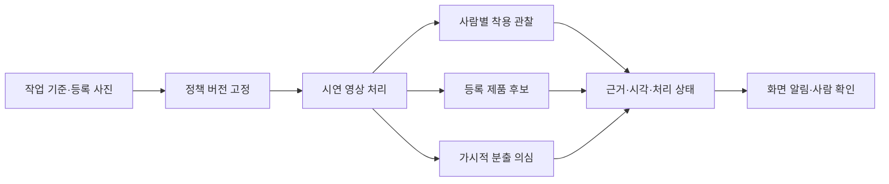

# ChemiGuard PRD — 해커톤 신규 구현

작성 기준: 2026-10-08 사전 기록. 구현 대상일: 2026-10-09. 상태: **제품 요구사항과 구현 계획이며, 당일 구현 완료 기록이 아니다.**

이 문서만 읽어도 제품 범위와 완료 기준을 이해할 수 있게 작성했다. 기술 계약·가중치 목록은 [ARCHITECTURE.md](ARCHITECTURE.md), 실험의 입력·출력·실패 사례는 [PREWORK.md](PREWORK.md)를 함께 제공한다. 기존 실험 코드를 그대로 운용하는 계획이 아니다. 사용자는 **가중치와 설계 지식을 가져가 빈 저장소에서 새로 구현**하기로 했다.

## 1. 제품이 해결할 문제

현장 담당자는 영상에서 작업자의 보호복 착용과 가시적 분출·유출 의심 장면을 놓치지 않고, 근거를 보고 후속 확인을 해야 한다. 현재 사전 실험은 사람·PPE 후보 검출, 제품 외형 검색, 착용 관찰, 분출 검출을 각각 보여주지만, 자동 안전 승인을 입증하지 못했다.

ChemiGuard의 해커톤 목표는 **“의심 장면을 사람에게 근거와 함께 전달하고 확인 기록을 남기는 도구”**다. 화학복이 보이는 것, 몸에 입고 있는 것, 등록 제품과 닮은 것, 해당 작업에 적합한 것은 다른 사실이다. 화면과 데이터에서 이 차이를 유지한다.

### 사용자와 핵심 업무

| 사용자 | 필요한 동작 | 제품이 제공할 결과 |
|---|---|---|
| 현장 안전 담당자 | 작업 기준 선택, 화학복 요구사항 확인 | 버전이 고정된 시연 정책 |
| 관제 담당자 | 의심·확인 불가 장면 선별 | 사람 ID 또는 장면 이벤트, 근거 프레임, 사유, 관측 시각 |
| 확인 담당자 | 근거를 보고 확인·반려·보류 | 모델 원결과와 분리된 검토 기록 |
| 발표자·심사위원 | 무엇을 실제로 실행했는지 확인 | 실시간 처리/저장 재생 표시, 사전/당일 구현 구분, 실제 측정표 |

## 2. 운영 조건과 범위

- 기본 연산 장치: **기존 Linux PC, RTX 3090 24GB, RAM 64GB**. 맥북 M3 Pro 18GB는 원격 조작·화면·발표용이다. 이전 Mac 단독 추론 설계는 이 문서의 기본안이 아니다.
- 당일 첫 범위: **영상 1개, 동시에 보이는 사람 1~2명, 화학복 1개 요구 항목, 가시적 분출 의심 1개 범주**. 다중 카메라 처리량을 주장하지 않는다.
- 외부 API 사용 가능은 사용자 제공 조건이다. 클라우드로 보내는 영상은 사용자가 허용한 **시연 자료의 crop**으로 제한한다. 실사업장 영상 외부 전송은 이번 완료 범위가 아니다.
- 외부 GPU 클라우드는 기본안에 포함하지 않는다. 3090 원격 접속 실패 시 새 클라우드 배포를 즉석에서 약속하지 않고, 장애 표시 또는 당일 검증한 저장 시연으로 전환한다.
- 오픈 라이선스 자산을 사용한다. AGPL도 오픈 라이선스이며 관련 공개 의무와 출처를 보존한다. 별도 학습 데이터·사진·영상의 권리는 모델 코드 라이선스와 분리한다. 권리 미확인은 공개 재배포 허가로 바꾸지 않는다.
- 기존 소스·가상환경·DB·결과·미디어를 자동 반입하지 않는다. **가중치만으로는 시연이 완성되지 않는다.** 당일 사용 가능한 사진·영상 확보, 새 등록, API 키·네트워크·패키지 준비를 일정에 포함한다.

## 3. 제품 원칙과 상태 정의

화면에는 다음 네 축을 따로 표시한다. 숫자 유사도를 “정확도 90%”처럼 표시하지 않는다.

| 축 | 상태 | 의미 |
|---|---|---|
| 착용 관찰 | `WORN / NOT_WORN / UNKNOWN` | 관찰 가능한 화학복 착용 상태. 제품 인증이나 화학적 적합성 승인 아님 |
| 제품 외형 | `CANDIDATE / UNRESOLVED / UNAVAILABLE` | 등록 사진 중 외형 후보 또는 검색 불가. 보정 전에는 정확 제품 확정 상태를 만들지 않음 |
| 처리 상태 | `RUNNING / WAITING / STALE / ERROR / STOPPED` | 영상·API·GPU 처리 상태. UNKNOWN과 장애를 혼용하지 않음 |
| 검토 상태 | `OPEN / ACKNOWLEDGED / DISMISSED / DEFERRED` | 사람의 확인 이력. 모델 예측을 수정하지 않음 |

상위 사건 상태는 `VIOLATION_SUSPECTED / RELEASE_SUSPECTED / REVIEW_REQUIRED / NO_ALERT_OBSERVED`다. `NO_ALERT_OBSERVED`는 현재 유효한 관측에서 경보 조건이 없다는 뜻이며 **안전·무누출·제품 적합성 보증이 아니다**. 처리 오류가 있는데 “경보 없음”으로 보이게 하지 않는다. 등록 제품 확인이 필요한 작업에서는 외형 후보만으로 규칙 충족을 확정하지 않는다.

## 4. 핵심 사용자 흐름

1. 담당자가 작업명·카메라/영상 구역·화학복 필요 여부·후드/여밈 요구 여부를 입력한다. 별도 카탈로그 페이지의 초안을 가져올 수 있으나 수동 입력만으로도 진행할 수 있어야 한다.
2. 제품 이름과 이용 가능한 사진을 등록한다. 사진의 화학복 몸통 영역·앞/뒤/옆 구분·출처를 저장하고 임베딩을 만든다. 링크만 저장한 상태와 실제 사진 등록 완료를 구분한다.
3. 시연 영상과 정책 버전을 선택해 실행한다. 원본 프레임에서 사람을 찾고 ID를 유지한다.
4. 사람별 착용 관찰과 제품 후보를 따로 표시한다. 장면 전체의 가시적 분출 의심 분석도 갱신한다. 어느 한 API의 지연으로 다른 관측을 멈추지 않는다.
5. 반복 확인된 위반 의심·분출 의심은 화면 알림과 이벤트 목록에 남긴다. 가림·해상도 부족은 확인 필요 사유로 표시한다.
6. 담당자가 해당 관측 시각의 원본 맥락과 crop을 보고 확인·반려·보류한다. 후속 조치는 담당자와 절차 연결로 제한한다.

## 5. 기능 요구사항

P0는 당일 구현·검증해야 하는 제품 범위다. 현재 완료 여부와 혼동하지 않는다. P1은 P0 통과 뒤 남은 시간에만 진행한다.

| ID | 우선순위 | 요구사항 | 현재 사전 상태 | 당일 목표 |
|---|---|---|---|---|
| F01 | P0 | 수동 정책 생성·선택·버전 고정 | 기존 카탈로그↔연구 DB 수동 시연 연결 구현 | 새 DB에 작업·요구 항목·등록 사진 버전을 저장 |
| F02 | P0 | 사진 등록 및 외형 후보 표시 | CLI 등록·벡터 저장, 몸통 직접 검색 실험 완료 | 간단한 업로드와 영역 지정, 제품별 참고 순위. 자동 제품 승인 없음 |
| F03 | P0 | 사람별 추적·원본 crop | n/s/m/l 비교, 원본 crop·추적 구현 | 권장 모델로 새 실행, ID와 관측 시각 보존 |
| F04 | P0 | 화학복 착용·가시성 관찰 | Responses 경로·5부위 조건·지연 응답 폐기 구현 | 같은 규칙을 새 구현하고 최종 버전에서 재검증 |
| F05 | P0 | 가시적 분출 의심 | 별도 모델·영상 평가 존재 | 장면 분석 분기와 근거 이벤트 연결. 범위를 실제 가시적 징후로 표시 |
| F06 | P0 | 비동기 실행·장애 격리 | PPE 내부 비동기, PPE/유출 동시 실행 미검증 | API 지연 중 사람·분출 분석과 화면 갱신 지속 |
| F07 | P0 | 이벤트·근거·화면 알림 | 저장 분석 기반 검토 화면 구현 | 새 실행 이벤트의 원본 프레임·crop·시각·사유·모델 정보를 제공 |
| F08 | P0 | 사람 확인·반려·보류 | append-only 검토 구현, 연결시험 기록만 존재 | 새 사건에 담당자·시각·의견을 추가. 예측 보존 |
| F09 | P0 | 실행·입력·설정 추적 | run 단위 hash/log 등 구현 | 새 실행 ID, 정책·모델 hash, 입력 출처, 설정, API 결과·사용량 기록 |
| F10 | P0 | 사전/당일 공개와 재현 | 사전 보고서·결과 다수 존재 | PREWORK와 실제 당일 커밋·시험·시연을 분리 |
| F11 | P1 | 카탈로그 초안 가져오기 | 44제품·상담·색상 비교 별도 구현 | 별도 페이지의 JSON 계약 연결. 감시를 상담 완료에 종속시키지 않음 |
| F12 | P1 | 담당자 전달 편의 | 외부 통보 미확인 | 사건 JSON/근거 링크 내보내기. 실제 Slack/SMS는 별도 명시적 요청 시만 |

### 제품 등록의 최소 정의

- 최소 1장으로 등록 가능하게 한다. 권장 입력은 **실제 착용 앞·뒤·옆 3장**이지만 충분한 성능을 보장하는 숫자가 아니다.
- 같은 제품의 사진이어도 이미지마다 개별 임베딩·영역·출처를 저장한다. 검색 입력이 몸통이면 몸통 reference끼리만 비교한다.
- 사진 수/영역/모델/전처리가 바뀌면 기존 보정값은 재사용하지 않는다. 당일 P0는 상위 후보와 미확정 상태만 제공하므로 임의 threshold를 채울 필요가 없다.
- 타제품 또는 일반옷에서 가장 가까운 등록 제품이 나와도 해당 제품 착용으로 표시하지 않는다.

## 6. 비목표

- 화학물질 이름·농도·보이지 않는 가스·누출량·사고 원인 식별.
- 영상만으로 내화학성·보호등급·인증·정확 SKU·회사 안전 사용승인 확정.
- 헬멧·장갑·신발·호흡·안면 보호구 전체 조합의 자동 착용 판정. 별도 개발 코드가 있다는 사실은 검증 완료를 뜻하지 않는다.
- 넘어짐·실신·차량 전도, 신규 모델 학습, 합성 영상 자동 생성, DINOv3 도입, 다중 인코더 합의.
- 사람 실명 식별·카메라 간 재식별, 다중 카메라 관제, 자동 설비 정지·대피 명령.
- 공개 SaaS·Vercel 배포·회사별 클라우드 DB를 감시 P0의 선행 조건으로 만들기.
- 특정 파일명·프레임 번호·사람 ID·제품 정답에 따른 예측 하드코딩. 정답은 평가기에서만 사용하며 모델·정책 입력에 넣지 않는다.

## 7. 검증 계획과 완료 기준

### 7.1 개발 자료와 별도 평가 자료

**개발 회귀 자료:** V08 착탈의/두 사람, ENEX, V12 작업장, S36 EDS, I007/I052, 기존 Luna 7사진, 누출 외부 참고 26영상과 그중 가스·증기 21영상 subset 등 이미 보고 수정에 사용한 자료다. 다른 프레임을 뽑아도 원 촬영 그룹이 같으면 독립 현장 시험으로 이름을 바꾸지 않는다. 출처·파일 경로는 PREWORK에 있다.

**당일 별도 평가 자료(아직 미확보·미라벨링):** 가능한 범위에서 새로운 촬영 그룹 또는 당일 직접 촬영한 정상·부분 착용·가림 사례, 누출 양성·비슷한 음성·사람 없는 장면을 확보한다. 자료 선택과 사람이 만든 관찰 기준을 모델 출력 확인 전에 고정한다. 최소 목표는 아래 표의 시각 사례 6종을 각각 1개 이상 확보하는 것이다. 이 소수 표본으로 일반 정확도를 주장하지 않는다.

독립 자료를 못 구하면 기존 자료만으로 **개발 회귀·연결 검증 완료**라고 공개한다. 별도 평가 미완료 상태는 제품 문서와 발표에 남기고 데이터가 있는 것처럼 합격표를 채우지 않는다. 같은 자료를 반복해 지연만 측정했다면 고유 자료 수와 호출 수를 따로 적는다.

### 7.2 시나리오별 통과 기준

아래는 **앞으로 수행할 검수 조건**이다. 수치는 기존 성과가 아니다. 실패 시 해당 기능을 수정하거나 미완료로 표시하며, 문제 사례를 숨기지 않는다.

| ID | 사례 | 통과 기준 |
|---|---|---|
| A01 | 온몸이 충분히 보이는 정상 착용 | 착용 관찰 WORN. 제품 후보·적합성은 별도이며 근거 프레임 일치. 최종 안전 승인 문구 없음 |
| A02 | 허리까지만 입음·팔을 뺌, 필수 후드 미착용·여밈 열림 | 부분 착용은 관찰 NOT_WORN과 반복 관측 후 위반 의심. 몸에 입었어도 요구 후드·여밈 위반은 별도 위반 의심. 등록 제품 검색 실패로 명백한 위반을 감추지 않음 |
| A03 | 몸에 가려진 팔·다리, 화면 밖, 작은 사람 | UNKNOWN과 구체 사유. 보이지 않은 부위를 보았다고 표시하거나 미착용으로 단정하지 않음 |
| A04 | 비슷한 색의 타제품·일반 작업복 | 후보가 나와도 제품 일치/안전 승인으로 바꾸지 않음. 오검색을 그대로 기록 |
| A05 | 가시적 분출 양성 | 사람 확인용 의심 사건과 정확한 입력 시각·박스 제공. 가스종·무색 가스·누출량을 표시하지 않음 |
| A06 | 구름·증기·먼지 등 음성/교란, 사람 없는 장면 | 발생 경보를 정답과 대조해 기록. 오경보가 있으면 당일 검수 실패 또는 범위 제한을 명시; 사람·PPE 상태를 만들어내지 않음 |
| A07 | API 429/500·접속 실패·잘못된 JSON | 해당 사람을 ERROR/UNKNOWN으로 표시. 정상 상태 유지 금지, 무한 재시도 금지, 분출 분기는 계속 갱신 |
| A08 | API 응답 지연·역순 도착·ID 재사용 | 만료·구세대·이미 적용한 관측보다 오래된 결과는 적용하지 않음. 최신 연속 2관측만 합의하며 서로 다른 사람의 결과 결합 0건 |
| A09 | 영상 종료·끊김·일시정지·탐색 이동 | STOPPED/STALE을 표시하고 재시작/탐색 시 관측 세대 초기화. 이전 정상 결과가 새 장면에 남지 않음 |
| A10 | 등록 사진/정책 변경 | 새 revision과 새 실행 요구. 기존 벡터·결과를 조용히 재사용하지 않음 |
| A11 | 사람이 근거 확인 후 보류/반려 | 원 예측 보존, 검토자·시각·메모 재조회 가능 |
| A12 | Mac↔PC 연결 상실·GPU 작업 실패 | 연결/처리 장애 표시, 녹화 재생은 명시적으로 표기. 실시간 분석을 가장하지 않음 |

인위적인 장애 응답 주입은 오류 처리 시험으로 명시하며 실제 API 품질 측정에 합산하지 않는다. 복잡한 전체 테스트 프레임워크 대신 이 시나리오에 대응하는 최소 fixture와 짧은 실제 실행을 사용한다. 가림을 모두 UNKNOWN으로 보내는 것만으로 좋은 모델이라고 평가하지 않도록 판정 가능한 정상 사례의 WORN 비율도 함께 본다.

### 7.3 측정 항목과 제안 목표

| 지표 | 측정 방법 | 당일 제안 목표·제한 |
|---|---|---|
| 잘못된 긍정 | 시각 검수된 위반/확인 불가가 WORN으로 표시된 수 / 해당 사례 수 | 최소 검수 세트에서 0건 요구. 모집단 정확도 보장 아님 |
| 사람 검출 누락·중복 | 고정 주석 프레임의 IoU≥0.5 일대일 대응, 배경·중복 따로 집계 | s/l 선택용; 실제 측정 후 n/N 공개 |
| 가림 처리 | UNKNOWN 사유와 사람 관찰 대조 | 가린 부위를 관찰 완료로 바꾸지 않음 |
| 분출 사건 검출 | 영상 구간별 양성·음성 경보, 최초 유효 경보까지 시간 | 프레임 수를 독립 사건 수로 세지 않음; 아직 합격률 실측 없음 |
| 첫 착용 관찰 지연 | 입력 관측 수집→유효 응답 적용 | 1~2명 조건 p95 ≤5초 목표, 미달 시 공개·범위 조정 |
| 반복 확인 알림 지연 | 사건 가시화 시작→합의된 이벤트 | 판정 가능한 사례 ≤8초 목표; 가림과 대기는 별도 상태 |
| 장면 분석 갱신 | GPU/입력 포함 새 로컬 관측 횟수 | 최소 5회/초 목표. 원 영상 FPS·화면 재생 FPS와 분리 |
| API 비용 | 실제 입력/캐시/출력 token·실제 tier·당시 단가 | 실행별 사용량/추정 비용 기록. 월비용·호출당 고정 비용 약속 없음 |
| 안정성 | 1~2명 영상 2분 1회, API 장애 중 독립 분기 확인 | 큐 무한 증가·OOM·과거 결과 재적용 0. 아직 미실행 |

현재 PC의 과거 7.95~8.53 처리 FPS와 API 약 1.2~1.4초 사례는 새 아키텍처의 측정값이 아니다. 이 수치로 위 목표 통과를 대신하지 않는다.

### 7.4 완료 선언

P0 코드·실제 실행·근거 확인·오류 처리·당일 측정표가 모두 있어야 “당일 구현 완료”다. 별도 평가가 없으면 “회귀·연결 검증 수준”으로 한정한다. 일부 정상 사례만 성공했거나 저장 결과만 연결했다면 이를 실시간 감시 완성으로 표현하지 않는다. API 키, 프롬프트, 환경 경로를 가진 것만으로 호출 성공이나 원격 연결 완료를 주장하지 않는다.

## 8. 당일 우선순위와 발표

1. 빈 저장소 등록과 사전 자산 공개 → PC·Mac 연결·가중치 로딩·시연 자료 확보.
2. 사람/장면 분석·근거 표시 → 착용 API와 사건 기록 → 사람 확인.
3. 제품 참고 검색과 수동 정책 연결 → 실패 시나리오 확인.
4. 설정 동결 → 별도 평가 또는 개발 회귀 → 당일 실제 실행 녹화 → 제출.

시간 부족 시 카탈로그 자동 상담·YOLOE 추가·새 학습·클라우드 GPU부터 제외한다. 근거 표시·UNKNOWN·장애 처리·원결과 보존을 제거해 기능 수를 늘리지 않는다. 상세 순서와 중단 조건은 ARCHITECTURE에 있다.

4분 발표는 문제/사용자 → 착용·가림·분출 장면 → 담당자 확인 → 사전 지식과 당일 개선/한계 순으로 구성한다. 아직 존재하지 않는 개선 효과를 대본에 넣지 않는다. 공식 규정과 사용자 선택의 구분은 PREWORK에서 설명한다.
